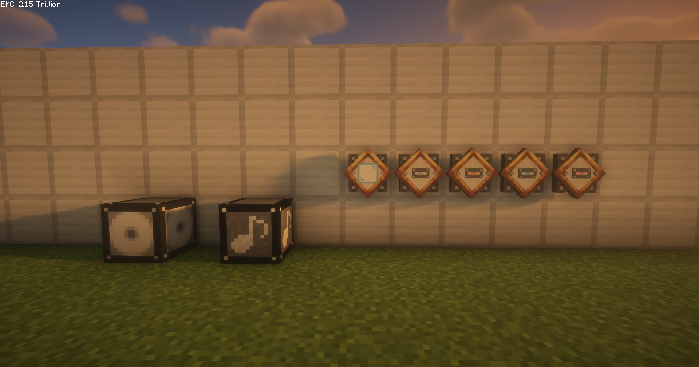
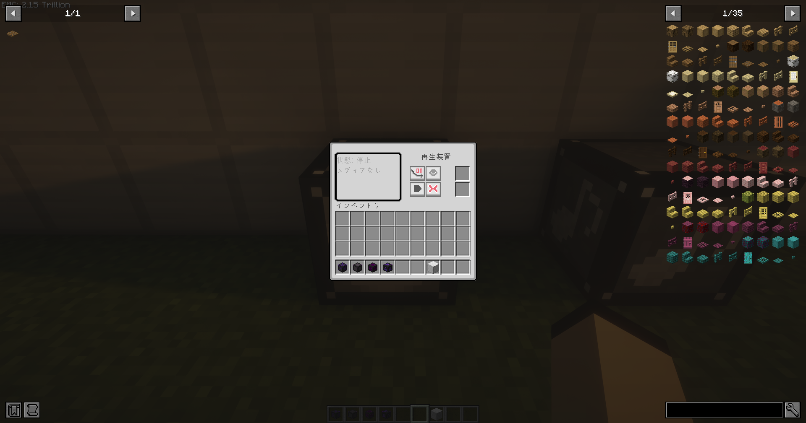
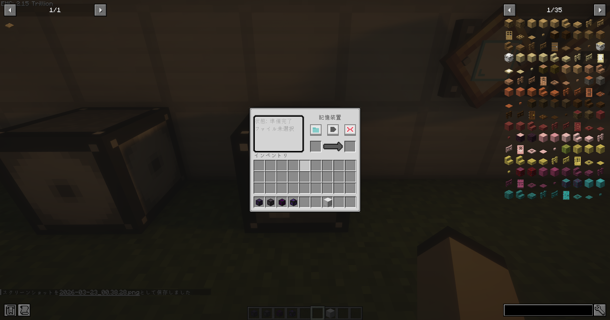

# Station Sound System

<p align="center">
  
</p>

<p align="center">
  <strong>Custom Audio Playback for Minecraft — MP3 / OGG / WAV</strong>
</p>

<p align="center">
  
  
  
  
</p>

[日本語](#japanese) | [English](#english)

---

<a id="japanese"></a>
## 🇯🇵 日本語 (Japanese)

ゲーム内でカスタム音声ファイル（MP3 / OGG / WAV）を再生できる **NeoForge Mod** です。録音装置で音声を記録媒体に書き込み、再生装置で再生。範囲指定ボードで音声の聞こえる範囲と減衰を設定できます。マルチプレイ対応。

### 📦 依存Mod
| Mod | バージョン | 必須 |
|-----|-----------|------|
| NeoForge | 21.1.168+ | ✅ |

※ 他のModへの依存はありません。単体で動作します。

### 📸 スクリーンショット

<p align="center">
  
  <br><em>追加アイテム・ブロック一覧 — 再生装置、録音装置、記録媒体（MP3/OGG/WAV）、範囲指定ボード</em>
</p>

<p align="center">
  
  <br><em>再生装置GUI — 再生/停止、減衰モード切替、範囲指定ボードスロット</em>
</p>

<p align="center">
  
  <br><em>録音装置GUI — ファイル選択、書き込みボタン、記録媒体スロット</em>
</p>

### ✨ 追加アイテム・ブロック

#### 🔊 再生装置（ブロック）
記録媒体に書き込まれた音声を再生するブロックです。

| 項目 | 詳細 |
|------|------|
| スロット | 記録媒体 × 1、範囲指定ボード × 1 |
| レッドストーン | 信号の立ち上がりで再生開始 |
| マルチプレイ | 全プレイヤーに同時再生 |

**機能:**
- 再生 / 停止ボタンでGUIから操作
- 範囲指定ボードをセットすると範囲内のみ音声が聞こえる
- 減衰モード: 範囲の境界で音量がなめらかに減衰
- レッドストーン入力で自動再生（回路による自動化が可能）
- ブロック破壊時に全クライアントの再生を自動停止

---

#### 🎙️ 録音装置（ブロック）
PCのローカルファイルから音声を記録媒体に書き込むブロックです。

| 項目 | 詳細 |
|------|------|
| 対応形式 | MP3 / OGG / WAV |
| スロット | 記録媒体 × 1 |

**操作方法:**
1. 記録媒体をスロットにセット
2. ファイル選択ボタンでPCの音声ファイルを選択
3. 書き込みボタンで記録媒体に保存

---

#### 💿 記録媒体（アイテム）
音声データを保存するアイテムです。

| 項目 | 詳細 |
|------|------|
| 保存方式 | サーバー側ファイルベース（UUID参照） |
| 対応形式 | MP3 / OGG / WAV |

- 音声データはワールドの `stationsoundsystem_audio/` ディレクトリに個別ファイルとして保存
- アイテム自体にはUUID参照のみ保持（軽量・破損耐性）
- 書き込まれた音声形式に応じてアイテムのテクスチャが変化（MP3 / OGG / WAV）
- ツールチップにファイル名と形式を表示

---

#### 📋 範囲指定ボード（アイテム）
2点を指定して音声の聞こえる3D範囲を設定するツールです。

| 項目 | 詳細 |
|------|------|
| レイキャスト距離 | 最大64ブロック |
| モード | 通常範囲指定 / 減衰率設定 / 下向き設定 |

**操作方法:**
| 操作 | 動作 |
|------|------|
| 右クリック（ブロック） | 座標を設定（Pos1→Pos2交互） |
| 右クリック（空中） | 64ブロック先までレイキャストして座標設定 |
| Shift + 右クリック | 座標をクリア |
| スクロール | モード切替 / 減衰値調整 |

**HUD表示:**
- 手に持つとホットバー上にモードパネルを表示
- Pos1のみ設定時、Pos2が視線先になめらかに追従するプレビュー
- Alt キーで減衰率設定パネルを展開
- 通知メッセージはアイテム名の下に表示（アクションバーと重ならない）

---

### 🔧 ビルド方法

```bash
gradlew.bat build
```

出力: `build/libs/stationsoundsystem-x.x.x.jar`

---

<a id="english"></a>
## 🇺🇸 English

A **NeoForge Mod** that lets you play custom audio files (MP3 / OGG / WAV) in-game. Record audio to storage media with the Recording Device, play it back with the Playback Device, and control the audible range with the Range Board. Multiplayer compatible.

### 📦 Dependencies
| Mod | Version | Required |
|-----|---------|----------|
| NeoForge | 21.1.168+ | ✅ |

No additional mod dependencies — works standalone.

### 📸 Screenshots

<p align="center">
  
  <br><em>Added Items & Blocks — Playback Device, Recording Device, Recording Media (MP3/OGG/WAV), Range Board</em>
</p>

<p align="center">
  
  <br><em>Playback Device GUI — Play/Stop, Attenuation Toggle, Range Board Slot</em>
</p>

<p align="center">
  
  <br><em>Recording Device GUI — File Selection, Write Button, Recording Media Slot</em>
</p>

### ✨ Added Items & Blocks

#### 🔊 Playback Device (Block)
A block that plays audio stored on recording media.

| Spec | Detail |
|------|--------|
| Slots | Recording Media × 1, Range Board × 1 |
| Redstone | Rising edge triggers playback |
| Multiplayer | Broadcasts to all players simultaneously |

**Features:**
- Play / Stop buttons in GUI
- Insert a Range Board to limit audio to a specific area
- Attenuation mode: smooth volume falloff at range boundaries
- Redstone automation support
- Automatically stops playback on all clients when block is broken

---

#### 🎙️ Recording Device (Block)
A block that writes audio from local PC files to recording media.

| Spec | Detail |
|------|--------|
| Formats | MP3 / OGG / WAV |
| Slots | Recording Media × 1 |

**Usage:**
1. Insert recording media into the slot
2. Select an audio file from your PC
3. Press the write button to save to media

---

#### 💿 Recording Media (Item)
An item that stores audio data.

| Spec | Detail |
|------|--------|
| Storage | Server-side file-based (UUID reference) |
| Formats | MP3 / OGG / WAV |

- Audio data saved as individual files in `stationsoundsystem_audio/` within the world directory
- Item holds only a UUID reference (lightweight, corruption-resistant)
- Item texture changes based on the stored audio format (MP3 / OGG / WAV)
- Tooltip displays filename and format

---

#### 📋 Range Board (Item)
A tool for defining the 3D audible range by specifying two corner points.

| Spec | Detail |
|------|--------|
| Raycast Distance | Up to 64 blocks |
| Modes | Normal Range / Attenuation / Downward |

**Controls:**
| Input | Action |
|-------|--------|
| Right-click (block) | Set coordinate (alternates Pos1→Pos2) |
| Right-click (air) | Raycast up to 64 blocks to set coordinate |
| Shift + Right-click | Clear coordinates |
| Scroll | Toggle mode / adjust attenuation |

**HUD Display:**
- Mode panel shown above hotbar while held
- Pos2 smoothly follows crosshair when only Pos1 is set
- Alt key expands attenuation settings panel
- Notification messages appear below item name (no action bar overlap)

---

### 🔧 Build

```bash
gradlew.bat build
```

Output: `build/libs/stationsoundsystem-x.x.x.jar`

---

### 🛠 Technology Stack / 技術スタック
- **Platform**: [NeoForge](https://neoforged.net/) 21.1.168+ (Minecraft 1.21.1)
- **Audio**: javax.sound (MP3 via JLayer, OGG via JOrbis, WAV native)
- **Storage**: Server-side file-based audio storage with UUID references

### 📄 License / ライセンス
[MIT License](LICENSE)
